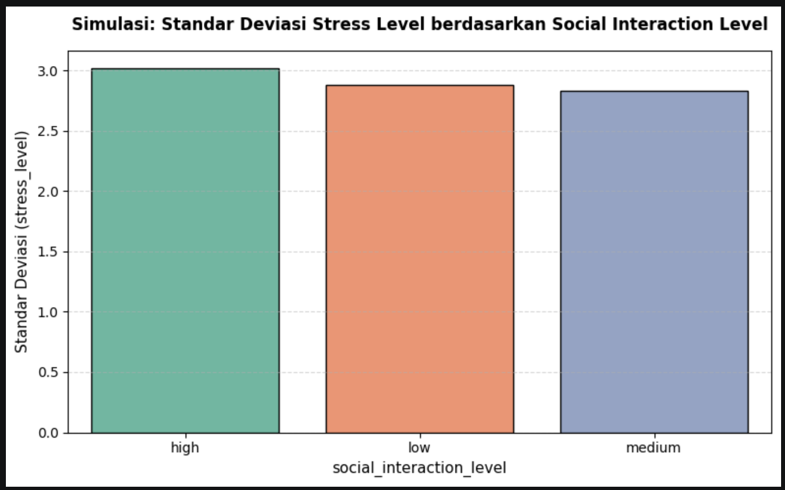
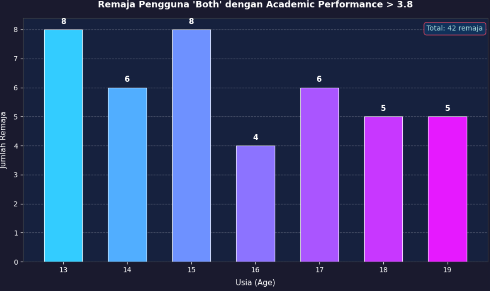
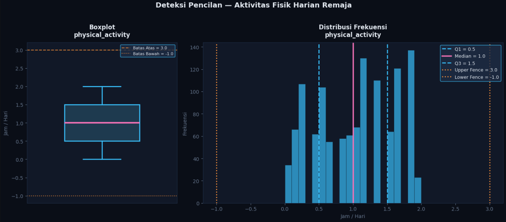
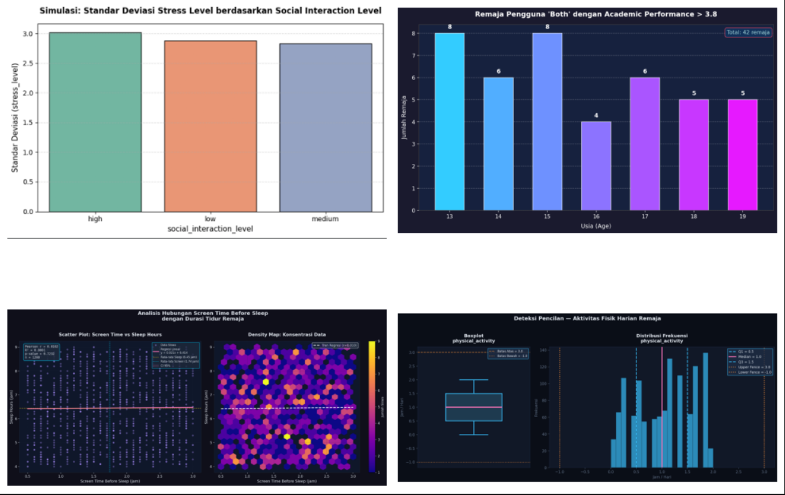

📊 POSTEST K7E
Analisis Data Remaja Menggunakan Python

🖥️ 📈 📊 🧠 📚

Disusun Oleh

Alfonso Abednego Manurung
NIM : 21060125130076

Program Studi Teknik Elektro
Universitas Diponegoro
2026

📌 Deskripsi Proyek

Proyek ini merupakan tugas Postest K7E yang bertujuan untuk melakukan analisis data menggunakan bahasa pemrograman Python. Analisis dilakukan terhadap dataset yang berkaitan dengan kesehatan mental remaja, aktivitas fisik, performa akademik, pola tidur, dan penggunaan media digital.

🎯 Tujuan

✅ Mengolah dataset menggunakan Python

✅ Menghitung statistik deskriptif

✅ Menganalisis korelasi antar variabel

✅ Mengidentifikasi outlier

✅ Membuat visualisasi data

✅ Menyajikan hasil analisis secara informatif

🛠️ Library yang Digunakan
Library	Fungsi
Pandas 🐼	Pengolahan data
NumPy 🔢	Komputasi numerik
Matplotlib 📊	Visualisasi data
Seaborn 🎨	Visualisasi statistik
SciPy 📈	Analisis statistik
📂 Struktur Proyek
Postest_K7E.ipynb
│
├── Dataset CSV
│
├── barchart_stress_level.png
├── barchart_both_academic.png
├── scatter_screen_sleep.png
├── boxplot_physical_activity.png
│
└── Dashboard Gabungan
📸 Dokumentasi Hasil Program
1️⃣ Grafik Standar Deviasi Tingkat Stres

Tempel screenshot hasil grafik di bawah ini

  

2️⃣ Grafik Academic Performance

Tempel screenshot hasil grafik di bawah ini

  

3️⃣ Scatter Plot Screen Time vs Sleep Hours

Tempel screenshot hasil grafik di bawah ini

  

4️⃣ Boxplot Physical Activity

Tempel screenshot hasil grafik di bawah ini

  

5️⃣ Dashboard Gabungan

Tempel screenshot dashboard akhir di bawah ini

  

🔍 Hasil Analisis
📊 Analisis Standar Deviasi

Program menghitung standar deviasi berdasarkan kategori tertentu untuk mengetahui tingkat penyebaran data pada setiap kelompok.

🎓 Analisis Academic Performance

Dilakukan filtering terhadap data remaja yang menggunakan media sosial dan game secara bersamaan serta memiliki performa akademik tinggi.

😴 Analisis Screen Time dan Sleep Hours

Menggunakan:

📌 Pearson Correlation

📌 Spearman Correlation

📌 Linear Regression

untuk mengetahui hubungan antara durasi penggunaan layar sebelum tidur dengan lama waktu tidur.

🏃 Analisis Outlier Physical Activity

Metode IQR digunakan untuk mendeteksi data pencilan (outlier) pada aktivitas fisik remaja.

📍 Rumus:

IQR = Q3 − Q1
Batas Bawah = Q1 − 1.5(IQR)
Batas Atas = Q3 + 1.5(IQR)
▶️ Cara Menjalankan Program
Buka Google Colab atau Jupyter Notebook.
Upload file Postest_K7E.ipynb.
Jalankan seluruh cell secara berurutan.
Upload dataset CSV ketika diminta.
Program akan menghasilkan analisis dan visualisasi secara otomatis.
✨ Kesimpulan

📈 Python mampu digunakan untuk melakukan analisis data secara efektif melalui kombinasi Pandas, NumPy, Matplotlib, Seaborn, dan SciPy.

📊 Hasil visualisasi membantu memahami pola hubungan antara aktivitas digital, performa akademik, pola tidur, serta aktivitas fisik remaja.

🧠 Analisis statistik yang dilakukan dapat digunakan sebagai dasar pengambilan keputusan berbasis data.

⭐ Terima Kasih ⭐

💻 📊 📈 🧠 🎓

Alfonso Abednego Manurung
21060125130076